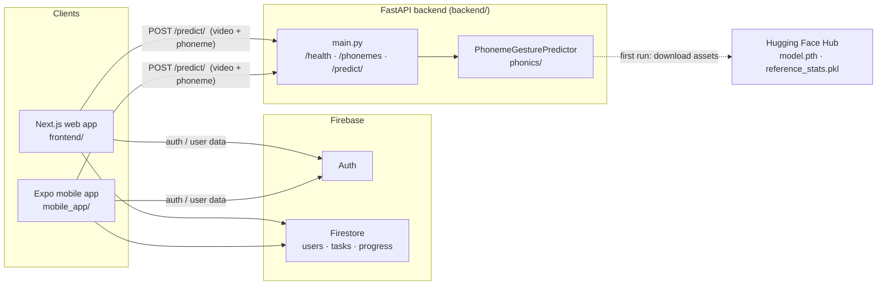
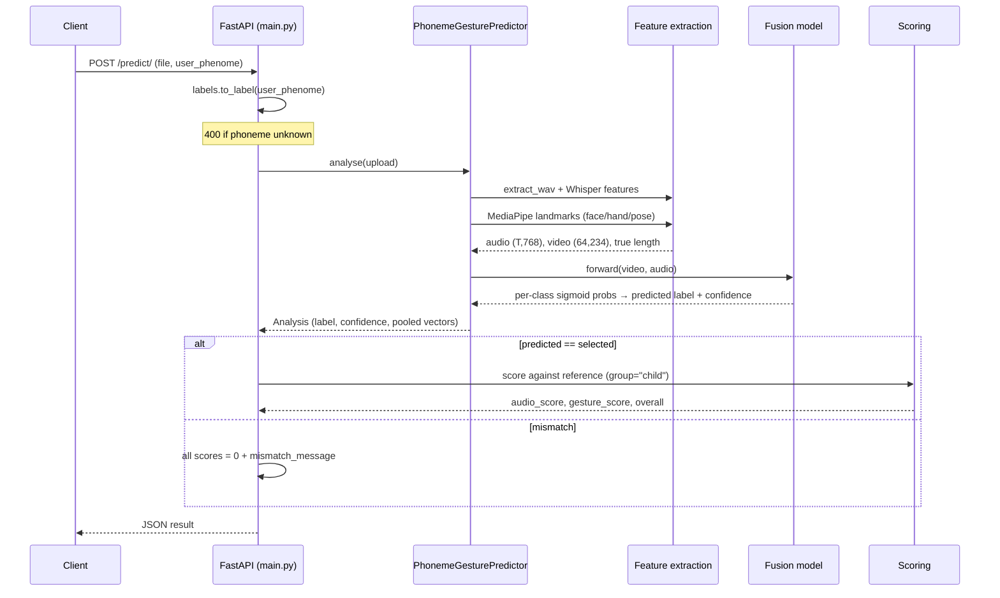
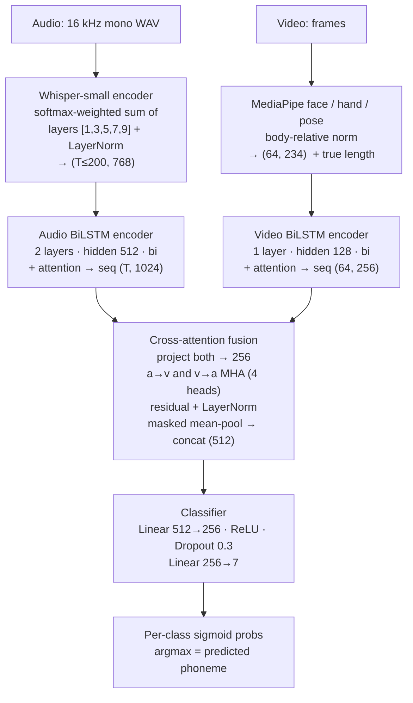
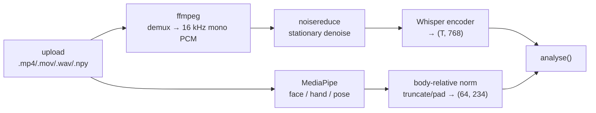

# JollyPhonics

An interactive phonics learning platform for children. A learner records themselves saying a phoneme; the system predicts which phoneme was actually spoken and grades both the **pronunciation** and the accompanying **Jolly Phonics hand/body gesture**, returning a 0–100 score.

The project is a monorepo with one backend and three clients:

| Component | Stack | Purpose |
|---|---|---|
| [backend/](backend/) | FastAPI + PyTorch | Model serving, feature extraction, scoring |
| [frontend/](frontend/) | Next.js 16 + React 19 + Firebase | Web app (students, instructors, admins) |
| [mobile_app/](mobile_app/) | Expo / React Native 0.79 | Mobile app |
| [colab/](colab/) | Python scripts | Model training and export |

---

## Table of contents

- [System overview](#system-overview)
- [How a request flows](#how-a-request-flows)
- [The model](#the-model)
  - [Model architecture diagram](#model-architecture-diagram)
  - [Audio branch](#audio-branch)
  - [Video branch](#video-branch)
  - [Cross-attention fusion](#cross-attention-fusion)
  - [Feature extraction pipeline](#feature-extraction-pipeline)
- [Scoring](#scoring)
- [Phoneme vocabulary](#phoneme-vocabulary)
- [Repository layout](#repository-layout)
- [Backend setup](#backend-setup)
- [Frontend setup](#frontend-setup)
- [Mobile app setup](#mobile-app-setup)
- [API reference](#api-reference)
- [Configuration](#configuration)
- [Deployment](#deployment)
- [Training and export](#training-and-export)
- [Troubleshooting](#troubleshooting)

---

## System overview



Clients handle authentication, roles and learner progress through **Firebase** (Auth + Firestore). Grading a recording is the one job that leaves Firebase: the client posts the media file and the selected phoneme to the backend's `/predict/`, and stores the returned scores back in Firestore.

The backend is stateless. It owns no database — it loads a model, scores an upload, and returns JSON.

---

## How a request flows



All extraction runs **once per upload**. `analyse()` produces both the classification and the mean-pooled vectors that scoring reuses, so Whisper and MediaPipe never run twice for one request. The upload is written to a per-request temp directory that is always cleaned up, including on error.

---

## The model

A two-branch **cross-attention fusion** network ([backend/phonics/architecture.py](backend/phonics/architecture.py)). The exported configuration is `fusion_type="cross_attn"`, `video_arch="bilstm_attn"` — the setup that produced the current best checkpoint.

The architecture must stay **byte-compatible with the training script**: the checkpoint is loaded by `state_dict` key, so any rename or shape change here silently breaks loading.

### Model architecture diagram



Padding is handled with attention masks throughout: the true (unpadded) sequence lengths are carried from feature extraction into `build_key_padding_mask()` so padded frames never contribute to attention or the masked mean pool.

### Audio branch

- **Whisper features** ([features.py](backend/phonics/features.py)) — a softmax-weighted sum over hidden layers `[1, 3, 5, 7, 9]` of `openai/whisper-small`, followed by LayerNorm, giving a 768-dim sequence of up to 200 frames. The layer weights and LayerNorm were **frozen at their initial values during training**, so they are reconstructed exactly here, not approximated. Whisper is loaded in **fp16** and its decoder is deleted after loading to keep the resident footprint small enough for 512 MB-class instances; hidden states are cast back to fp32 before the weighted sum, matching training.
- **Audio BiLSTM encoder** — 2-layer bidirectional LSTM (hidden 512, dropout 0.5) with LayerNorm and additive attention pooling. Sequence output dim 1024.

### Video branch

- **Landmarks** — MediaPipe face-mesh (mouth contour), hand and pose landmarks (shoulders, elbows, wrists), body-relative normalised to 234 dims per frame. Clips are **truncated to the first 64 frames or zero-padded**, and the *true* frame count is reported so the attention mask covers the padding — reproducing training exactly (the older exported `inference.py` time-warped clips onto 64 frames and disabled the mask; this does not).
- **Video BiLSTM encoder** — 1-layer bidirectional LSTM (hidden 128) with LayerNorm and additive attention pooling. Sequence output dim 256.

### Cross-attention fusion

Both encoder sequences are projected to 256 dims. Two `MultiheadAttention` blocks (4 heads) attend **audio→video** and **video→audio**, each with a residual connection and LayerNorm. The two context sequences are masked-mean-pooled and concatenated into a 512-dim vector, which a small MLP head (`512→256→7`, ReLU, dropout 0.3) classifies. The output is a **per-class sigmoid**; the argmax is the predicted phoneme and its probability (×100) is the confidence.

### Feature extraction pipeline



`.wav` inputs skip ffmpeg; `.npy` inputs are treated as pre-extracted landmark arrays and skip MediaPipe. Feature geometry constants (Whisper layers, frame caps, landmark index lists) live in [backend/phonics/config.py](backend/phonics/config.py) and are duplicated in `models/model_config.json`; `load_model_config()` reads that file and **raises on divergence** rather than letting the two drift apart silently.

### Model assets

Loaded from `backend/models/` (override with `PHONICS_MODEL_DIR`):

```
models/
├── model.pth             # cross-attention fusion checkpoint (bare state_dict)
├── label_map.json        # {label_to_id, id_to_label} — 7 classes
├── model_config.json     # feature geometry + arch hyperparameters
├── reference_stats.pkl   # {group: {label: reference}} — "child" and "elder"
└── hf_cache/             # cached openai/whisper-small
```

`model.pth` and `reference_stats.pkl` are **not committed** — `ensure_model_assets()` downloads them from Hugging Face Hub on first use. The model itself is loaded **lazily on the first request**, so imports stay cheap and startup is fast. Set `PHONICS_EAGER_LOAD=1` to load at boot instead (better for a warm production instance). If `reference_stats.pkl` is absent, predictions still work — only scoring is disabled.

---

## Scoring

Implemented in [backend/phonics/scoring.py](backend/phonics/scoring.py).

An attempt's mean-pooled audio and landmark vectors are compared against a **reference recording of the same phoneme**. The Euclidean distance is mapped onto 0–100 through a piecewise-linear curve whose breakpoints (`good` / `max` / `bad`) were calibrated **per class** at export time from the spread of the reference set:

| Distance band | Score range |
|---|---|
| ≤ good | 80–100 |
| ≤ max | 50–80 |
| ≤ bad | 20–50 |
| beyond | 1–20 |

References are grouped. `reference_stats.pkl` has two top-level groups — **`child`** (default, matches the learners) and **`elder`** (adult demonstrator recordings) — each mapping the seven training labels to their reference stats. Select the group with `PHONICS_REFERENCE_GROUP`.

The response carries three numbers:

- `audio_score` — pronunciation quality
- `gesture_score` — gesture accuracy (`null` if no face/pose was detected)
- `overall_score` — `0.5 × audio + 0.5 × gesture`, or just `audio_score` when there is no gesture signal

A **wrong phoneme scores zero** on all three regardless of delivery quality.

> **Known issue:** scores currently read low across the board. The scoring is a faithful port of the original `model_export/inference.py` behaviour, kept unchanged so that a scoring refinement can be evaluated independently of the backend port.

---

## Phoneme vocabulary

Seven classes, one per the first letter of Jolly Phonics groups 1–7:

| Chip (client) | Training label |
|---|---|
| `s` | `s first letter of gp 01` |
| `c/k` | `c-k first letter of group 02` |
| `g` | `g first letter of gp 03` |
| `ai` | `ai first letter of gp 04` |
| `z` | `z first letter of gp 05` |
| `y` | `y first letter of gp 06` |
| `qu` | `qu first letter of gp 07` |

Clients send the short chip names; the model was trained on the verbose folder-derived labels. All translation lives in [backend/phonics/labels.py](backend/phonics/labels.py), so the model's vocabulary never leaks into the API surface. Input aliases `c-k`, `ck`, `c` and `k` all resolve to `c/k`. Clients can fetch the list at runtime from `GET /phonemes` instead of hardcoding it.

---

## Repository layout

```
jollyphonics/
├── backend/                       # FastAPI service
│   ├── main.py                    # app + endpoints — transport/orchestration only
│   ├── config.py                  # API settings, CORS whitelist
│   ├── run.py                     # uvicorn bootrunner
│   ├── Dockerfile                 # python:3.10-slim + ffmpeg
│   ├── requirements.txt           # dependency ranges
│   ├── requirements-lock.txt      # exact resolved versions (known-good env)
│   ├── utils/
│   │   └── extract.py             # media extraction helper
│   ├── models/                    # model assets (model.pth + pkl gitignored)
│   └── phonics/                   # the model package
│       ├── __init__.py            # exports PhonemeGesturePredictor, labels
│       ├── predictor.py           # PhonemeGesturePredictor — single entry point
│       ├── architecture.py        # inference-time network (cross-attn fusion)
│       ├── features.py            # Whisper + MediaPipe extraction, ffmpeg
│       ├── scoring.py             # distance → score mapping
│       ├── labels.py              # chip name ↔ training label + aliases
│       └── config.py              # feature geometry, paths, HF asset download
│
├── frontend/                      # Next.js 16 web app (App Router)
│   ├── app/
│   │   ├── page.js  layout.js  globals.css
│   │   ├── welcome/  roles/                       # onboarding
│   │   ├── login/  signup/  login-success/  signup-success/
│   │   ├── student-dashboard/  instructor-dashboard/  admin-dashboard/
│   │   ├── tasks/  upload-video/  progress/       # learning flow
│   │   └── profile/  edit-profile/
│   ├── contexts/AuthContext.js    # auth/session context
│   ├── services/
│   │   ├── api.js                 # backend client (NEXT_PUBLIC_BACKEND_URL)
│   │   └── firebase.js            # Firebase Auth + Firestore
│   ├── public/                    # static assets
│   └── next.config.mjs  package.json  eslint.config.mjs
│
├── mobile_app/                    # Expo / React Native app
│   ├── App.js  index.js  app.json
│   ├── screens/                   # Splash, Welcome, Roles, Login, SignUp,
│   │                              #   Student/Instructor/Admin dashboards,
│   │                              #   Tasks, UploadVideo, Progress, Profile, ...
│   ├── components/
│   │   ├── AppNavigator.js        # React Navigation stack
│   │   └── EducationDoodleBackground.js
│   ├── contexts/AuthContext.js
│   ├── services/
│   │   ├── api.js                 # backend client
│   │   ├── firebase.js            # Firebase Auth + Firestore
│   │   └── networkConfig.js       # backend host (set your LAN IP for devices)
│   └── assets/                    # icons, animations
│
├── colab/
│   ├── train.py                   # training script
│   └── evaluate_and_export.py     # evaluate + export model/config/reference stats
│
├── upload_fusion_to_hf.py         # push fusion assets to Hugging Face Hub
├── upload_audio_model_to_hf.py    # push audio-only assets to HF Hub
└── run.bat / start_*.bat          # Windows dev helpers
```

---

## Backend setup

### Prerequisites

- **Python 3.11 or 3.12** (the Docker image pins 3.10)
- **ffmpeg** on `PATH` — a system package, not a pip install
- ~2 GB free disk for Whisper and the checkpoint

### Steps

```bash
cd backend
python -m venv .venv

# Windows PowerShell
.\.venv\Scripts\Activate.ps1
# macOS / Linux
source .venv/bin/activate

python -m pip install --upgrade pip
pip install -r requirements.txt

python main.py
```

The API starts on `http://127.0.0.1:8000`. Verify:

```bash
curl http://127.0.0.1:8000/health
# {"status":"healthy","message":"JollyPhonics backend is running"}
```

Interactive docs are at `http://127.0.0.1:8000/docs`. To reproduce an exact known-good environment, `pip install -r requirements-lock.txt` instead. On Windows, [run.bat](run.bat) and [start_backend.bat](start_backend.bat) wrap these steps.

---

## Frontend setup

```bash
cd frontend
npm install
npm run dev          # http://localhost:3000
```

Point it at the backend with a `.env.local`:

```
NEXT_PUBLIC_BACKEND_URL=http://localhost:8000
```

It defaults to `http://localhost:8000` when unset. Firebase (Auth + Firestore) is configured in [frontend/services/firebase.js](frontend/services/firebase.js); session state lives in [frontend/contexts/AuthContext.js](frontend/contexts/AuthContext.js). Build for production with `npm run build && npm start`.

---

## Mobile app setup

```bash
cd mobile_app
npm install
npx expo start        # then press a / i, or scan the QR with Expo Go
```

The backend host is set in [mobile_app/services/networkConfig.js](mobile_app/services/networkConfig.js). On a physical device, `localhost` refers to the phone — use your machine's LAN IP (e.g. `http://192.168.1.20:8000`) and make sure that origin is allowed by the backend's CORS settings.

---

## API reference

### `GET /health`

```json
{ "status": "healthy", "message": "JollyPhonics backend is running" }
```

### `GET /phonemes`

Returns the phoneme vocabulary so clients need not hardcode the chip list.

```json
{ "phonemes": ["ai", "c/k", "g", "qu", "s", "y", "z"] }
```

### `POST /predict/`

Grades one recording against the phoneme the learner selected.

**Body** (`multipart/form-data`):

| Field | Type | Description |
|---|---|---|
| `file` | file | Video (`.mp4`, `.mov`, `.avi`, `.mkv`) or audio recording. Max 100 MB. |
| `user_phenome` | string | The phoneme the learner intended, e.g. `g`, `ai`, `c/k` |

> The `user_phenome` spelling is retained for backwards compatibility with the deployed clients.

**Request**

```bash
curl -X POST "http://127.0.0.1:8000/predict/" \
     -F "file=@child_pronunciation.mp4" \
     -F "user_phenome=g"
```

**200 — match**

```json
{
  "predicted_phoneme": "g",
  "user_phoneme": "g",
  "is_correct": true,
  "audio_score": 84,
  "gesture_score": 71,
  "overall_score": 78
}
```

**200 — mismatch**

```json
{
  "predicted_phoneme": "c/k",
  "user_phoneme": "g",
  "is_correct": false,
  "audio_score": 0,
  "gesture_score": 0,
  "overall_score": 0,
  "mismatch_message": "You selected 'g' but your pronunciation sounded more like 'c/k'"
}
```

**400 — unknown phoneme**

```json
{ "error": "unknown phoneme 'x'", "known_phonemes": ["ai", "c/k", "g", "qu", "s", "y", "z"] }
```

**500** — `{ "error": "<message>" }`.

> **Response contract:** the `/predict/` shape is consumed by all three clients. Treat added fields as safe and removals or renames as breaking.

---

## Configuration

### Backend environment variables

| Variable | Default | Purpose |
|---|---|---|
| `PORT` | `8000` | Listen port (most hosts inject this) |
| `HF_REPO_ID` | `zainabraza06/phenome_classfication` | Hugging Face repo holding the model assets |
| `HF_TOKEN` | — | Required only if that repo is private |
| `PHONICS_MODEL_DIR` | `backend/models` | Where model assets live |
| `PHONICS_REFERENCE_GROUP` | `child` | Reference set to score against (`child` / `elder`) |
| `PHONICS_EAGER_LOAD` | unset | `1`/`true`/`yes` loads the model at startup instead of on first request |
| `BACKEND_CORS_ORIGINS` | — | Extra allowed origins, comma-separated |

### CORS

Safe defaults are hardcoded in [backend/config.py](backend/config.py): `localhost:3000`, Expo dev ports (`8081`, `19006`, `19000`), and the deployed frontends. Additional origins are appended (never replaced) via `BACKEND_CORS_ORIGINS`.

### Frontend

| Variable | Purpose |
|---|---|
| `NEXT_PUBLIC_BACKEND_URL` | Backend base URL |

---

## Deployment

### Backend (Docker)

The backend ships as a container — [backend/Dockerfile](backend/Dockerfile) is the single source of truth for how it is built and started.

```bash
docker build -t jollyphonics-backend backend/
docker run -p 8000:8000 -e PORT=8000 jollyphonics-backend
```

The image is `python:3.10-slim` with `ffmpeg`, `libsm6` and `libxext6` installed for OpenCV and MediaPipe. It listens on `$PORT` (default `10000` in the image, overridden above).

Whatever host runs the image needs:

- `HF_TOKEN` set if the model repo is private, so `ensure_model_assets()` can pull `model.pth` and `reference_stats.pkl` on first boot
- enough memory for Whisper-small plus the fusion checkpoint (see the fp16/decoder-deletion notes under [Audio branch](#audio-branch))
- a writable temp directory for ffmpeg scratch output

Mounting a persistent volume at `PHONICS_MODEL_DIR` avoids re-downloading the model assets on every container start.

### Frontend

The web app deploys to Vercel; `https://jolly-phonics-internship.vercel.app` is already in the backend CORS whitelist. Set `NEXT_PUBLIC_BACKEND_URL` to the deployed backend URL.

### Cold starts

On a cold container the first request pays for downloading the model assets from Hugging Face and loading the model — expect roughly **30–45 seconds**. Subsequent requests are fast. Two ways to avoid it:

- persist `PHONICS_MODEL_DIR` across restarts so the assets are already on disk
- set `PHONICS_EAGER_LOAD=1` so the model loads at startup rather than on the first request

On hosts that idle-stop containers, both of these are paid again after each wake.

---

## Training and export

- [colab/train.py](colab/train.py) — trains the cross-attention fusion model.
- [colab/evaluate_and_export.py](colab/evaluate_and_export.py) — evaluates the checkpoint and exports `model.pth`, `label_map.json`, `model_config.json` and `reference_stats.pkl` (including the per-class score breakpoints and both the `child` and `elder` reference groups). Writes `.xlsx` reports, hence the `openpyxl` dependency.

Upload helpers for pushing assets to Hugging Face Hub: [upload_fusion_to_hf.py](upload_fusion_to_hf.py), [upload_audio_model_to_hf.py](upload_audio_model_to_hf.py).

**If you retrain**, keep [backend/phonics/architecture.py](backend/phonics/architecture.py) in sync with the training script's class definitions, and re-export `model_config.json` so the feature-geometry check keeps passing.

---

## Troubleshooting

**`FileNotFoundError` for `model.pth`** — the HF download failed. Check network access and, if the repo is private, that `HF_TOKEN` is set. The server cannot serve predictions without it.

**`ffmpeg not found` / audio extraction fails** — install ffmpeg and confirm it is on `PATH` (`ffmpeg -version`).

**`ModuleNotFoundError`** — the virtual environment isn't active. Activate it before installing or running.

**Model config divergence error at startup** — `phonics/config.py` and `models/model_config.json` disagree on feature geometry. Re-export the config from the training run rather than editing one side by hand.

**`gesture_score` is `null`** — MediaPipe found no face or pose in the video (poor lighting, subject out of frame, or an audio-only upload). `overall_score` falls back to `audio_score`.

**CORS errors in the browser or mobile app** — add the origin to `BACKEND_CORS_ORIGINS`. Device testing needs your LAN IP, not `localhost`.

**Slow first request** — expected. The model loads lazily; set `PHONICS_EAGER_LOAD=1` to pay that cost at startup instead.
